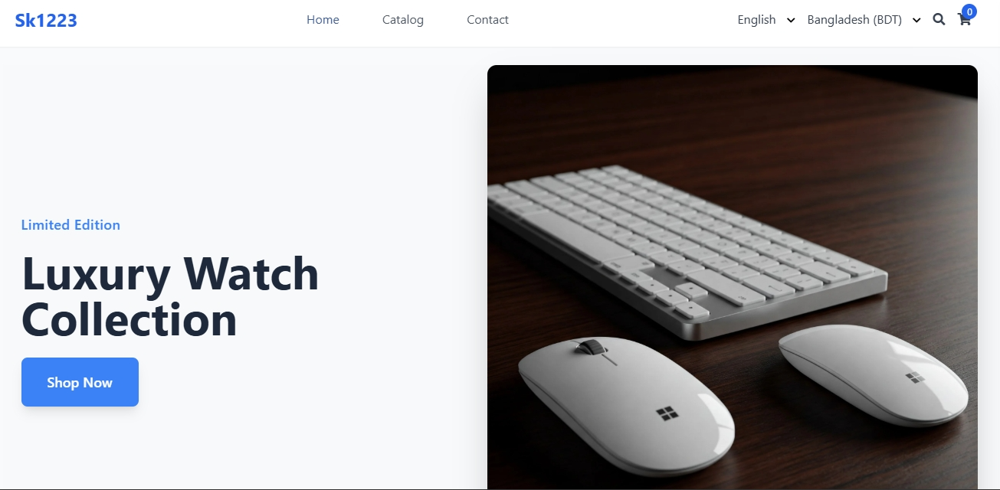

# eTrade - Custom Shopify Theme 🛍️


> A modern, responsive Shopify theme built with Liquid, TailwindCSS, and JavaScript.


[🌐 Visit Live Site](https://sk1223.myshopify.com/)

**Store Password:** `shuvosa67`


## ✨ Features

### Design & Layout
- 🎨 Responsive design that works across all devices
- 📱 Modern, clean interface using TailwindCSS
- 🎯 Custom hero section with slider functionality
- 📑 Professional header and footer sections
- 📦 Flexible grid layouts for products and collections

### Shopping Experience
- 🔍 Enhanced product pages
- 🏪 Store pickup availability
- 🛒 Smart cart functionality
- ⭐ Product reviews integration
- 💳 Quick checkout process

## 🚀 Tech Stack

- 
- 
- 

## 📁 Directory Structure

```
demo/
├── assets/
├── config/
├── layout/
├── sections/
├── snippets/
└── templates/
```

## 🛠️ Installation

1. Clone the repository:
```bash
git clone https://github.com/shuvosa/eTrade-Custom-Shopify-Theme.git
```

2. Install dependencies:
```bash
npm install
```

3. Start development:
```bash
shopify theme serve
```

## ⚙️ Configuration

1. Navigate to your Shopify admin panel
2. Go to Online Store > Themes
3. Click "Upload theme"
4. Select the theme zip file

## 🎨 Theme Customization

Edit `config/settings_schema.json` to modify:

- Color schemes
- Typography
- Layout options
- Header settings
- Footer configuration

## 📝 License

MIT © [Shohanur Islam]

## 🤝 Contributing

1. Fork it
2. Create your feature branch (`git checkout -b feature/amazing-feature`)
3. Commit your changes (`git commit -m 'Add amazing feature'`)
4. Push to the branch (`git push origin feature/amazing-feature`)
5. Open a Pull Request

## 📫 Support

- Email: shuvosa67@gmail.com
- Issues: [GitHub Issues](https://github.com/shuvosa/eTrade-Custom-Shopify-Theme/issues)


---
Made with ❤️ by [Shohanur Islam]
